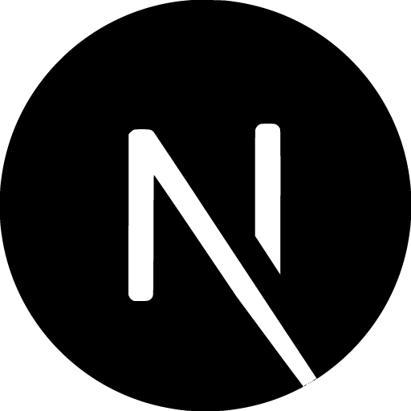
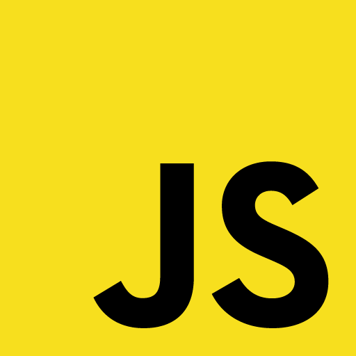
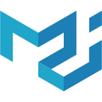

# Vladyslav Hrusha

#### Software Developer — Next.js &amp; NestJS

I build fast, accessible front-ends and the NestJS services behind them.
Currently designing and developing solo products

---

### Tech Stack

<table>
  <tr>
    <td align="center" width="33%"> TypeScript</td>
    <td align="center" width="33%">
      <picture>
        <source media="(prefers-color-scheme: dark)" srcset="public/icons/nextjs-dark.png">
        
      </picture>
       Next.js
    </td>
    <td align="center" width="34%"> Tailwind CSS</td>
  </tr>
  <tr>
    <td align="center"> NestJS</td>
    <td align="center"> PostgreSQL</td>
    <td align="center"> Claude</td>
  </tr>
  <!-- <tr>
    <td align="center"> JavaScript</td>
    <td align="center"> Redux</td>
    <td align="center"> MaterialUI</td>
  </tr> -->
</table>

<!-- ### Selected work

| Project | What it is | Stack |
| --- | --- | --- |
| [lifely](https://github.com/vladhrusha/lifely_private) | `one line on what it does →` | Next · Node · Mongo |
| [findbait_ai](https://github.com/vladhrusha/findbait_ai) | `one line on what it does →` | React · TS |
| [portfolio](https://github.com/vladhrusha/portfolio) | `one line on what it does →` | Next · MUI | -->
