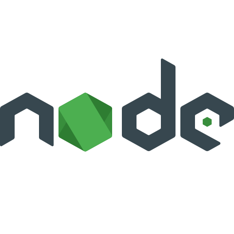

# Vladyslav Hrusha

Frontend Developer — React &amp; Next.js, MERN stack

I build fast, accessible product front-ends and the Node services behind them.
Currently deep in Next.js App Router, TypeScript and design-system work.

 

---

### Languages and Tools

<table>
  <tr>
    <td align="center" width="33%"> React</td>
    <td align="center" width="33%">
      <picture>
        <source media="(prefers-color-scheme: dark)" srcset="public/icons/nextjs-dark.png">
        
      </picture>
       Next.js
    </td>
    <td align="center" width="34%"> TypeScript</td>
  </tr>
  <tr>
    <td align="center"> JavaScript</td>
    <td align="center">
      <picture>
        <source media="(prefers-color-scheme: dark)" srcset="public/icons/nodejs-dark.png">
        
      </picture>
       Node.js
    </td>
    <td align="center"> Redux</td>
  </tr>
  <tr>
    <td align="center"> MaterialUI</td>
    <td align="center" colspan="2"><code>+ next up</code></td>
  </tr>
</table>

<!-- ### Selected work

| Project | What it is | Stack |
| --- | --- | --- |
| [lifely](https://github.com/vladhrusha/lifely_private) | `one line on what it does →` | Next · Node · Mongo |
| [findbait_ai](https://github.com/vladhrusha/findbait_ai) | `one line on what it does →` | React · TS |
| [portfolio](https://github.com/vladhrusha/portfolio) | `one line on what it does →` | Next · MUI | -->
