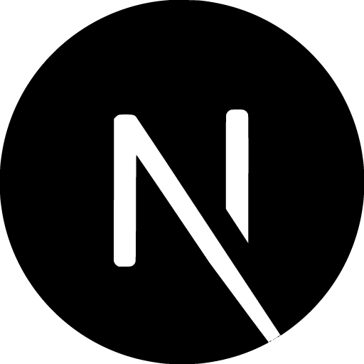

<h1 align="center" style="font-size: 36px">Hey there! I'm Vladyslav Hrusha</h1>
<h3 align="center" style="font-size: 20px">Frontend Developer | React, Next | MERN Stack </h3>

  <h3> 💻 Languages and Tools </h3>
  

    
    React
  

    

    
    Next
  

    
    TypeScript
  

    

    
    JavaScript
  

    

    

    
    MaterialUI
  

    

    

    
    Redux
  

      

    
    Node
  

  

